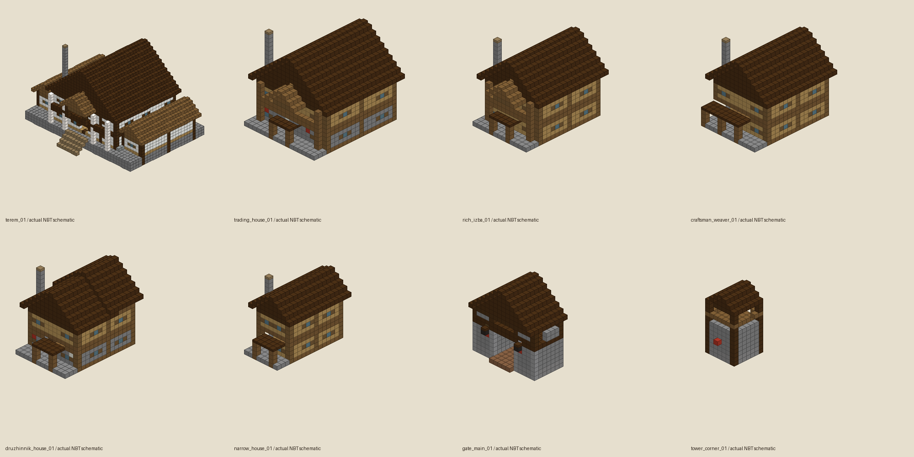
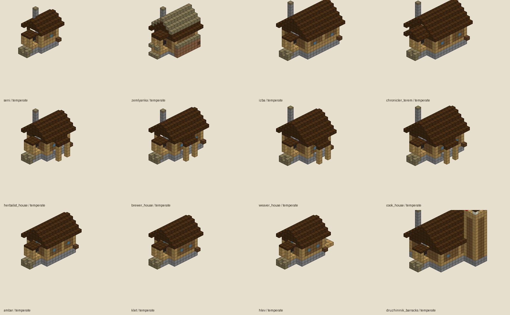
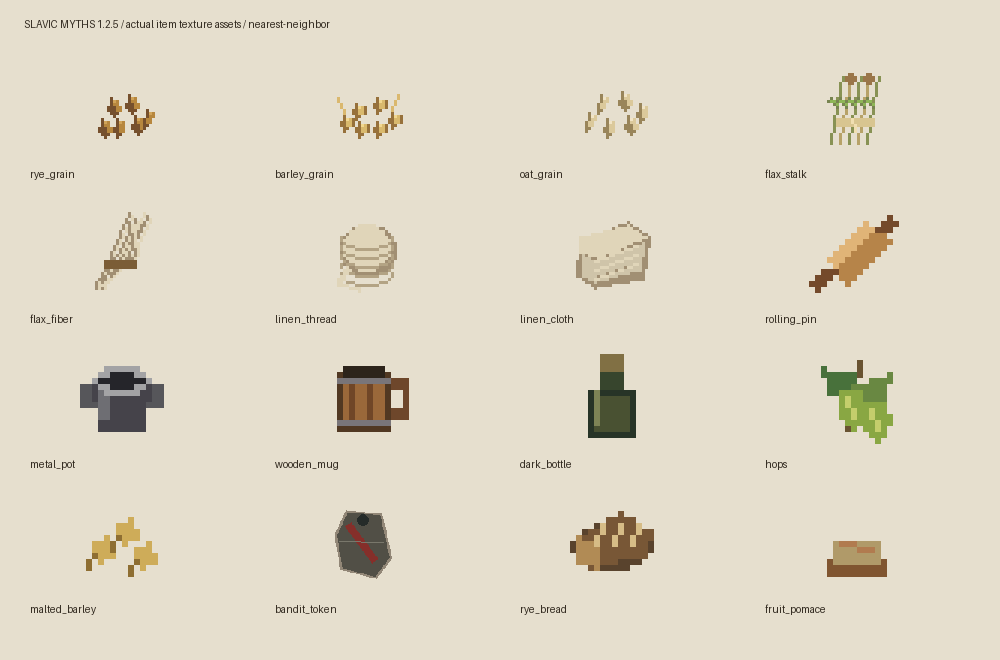

# Slavic Myths

Мод о славянской мифологии, исследовании мира и хозяйственной жизни: духи и боссы, курганы, разбойники, ритуалы, ремёсла и поселения. Фольклор и исторические мотивы адаптированы для игры; это не реконструкция единой исторической религии.

**Версия 1.3.3 · Minecraft 1.21.1 · NeoForge 21.1.255 · Java 21**

Рунные слоты брони: существующая наковальня и хранение рун без новых эффектов. [Таблица и проверки](docs/ARMOR_RUNE_SLOTS_1.3.3.md).

Classes 2.0: дерево навыков, выбор класса, управление и клиентские настройки HUD. [Изменения и проверки](docs/CLASSES_UI_1.3.2.3.md).

Редкое оружие: парные мечи Тугарина, посох Лихо, кистень атамана и копьё победителя. [Характеристики, рецепты и проверка](docs/RARE_WEAPONS_1.3.2.2.md).

*Схематическая проекция действующих NBT-шаблонов, не игровой скриншот. Цвета и форма отдельных блоков упрощены.*

## Что есть в моде

- Домовой, леший, водяной, русалка, банник и другие духи; приключенческие встречи и боссы, включая Бабу Ягу.
- Алтари, подношения, знания, репутация, ритуалы, руны, фольклорная книга и личная навигация.
- Оружие 2.0: копья, сулицы, кистени, метательные ножи семи материалов и два лука; детали и сборка на оружейном верстаке, просмотр рецептов без JEI.
- Классы 2.0: три базы, 18 ветвей, дерево навыков и эволюции; G/H/J — активные слоты, K — меню. Class XP пока выдаётся через API/debug `/smclass`, отдельно от vanilla XP.
- Курганы с помещениями и наградами, лагеря разбойников, болотные постройки и тематическая природа.
- Обновлённые деревни, одежда жителей для трёх климатов, профессии и торговля; редкое городище с улицами, теремом, торговым домом, площадью, стенами и воротами.
- Работа жителей в стандартном расписании Minecraft, реальные производственные цепочки и общий сундук поселения. Дружинники защищают жителей; разбойники совершают ограниченные налёты.
- Земледелие, садоводство, домашние животные, обработка льна, одежда, кухня, брожение и напитки, мебель и хозяйственное хранение. Мешок в 1.2.5 содержит пять слотов по 64 предмета.

*Схема действующих шаблонов деревни с упрощённым отображением блоков.*

*Реальные текущие текстуры предметов, увеличенные без сглаживания. Это лист ресурсов, а не вид предметов в игре.*

## Установка

1. Подготовьте профиль Minecraft **1.21.1** с NeoForge **21.1.255** и Java **21**. Metadata допускает NeoForge `[21.1.255,21.2)`; проверенная версия — 21.1.255.
2. Установите **Curios API 9.5.1 для 1.21.1** (требуемый диапазон `[9.5.1,10)`).
3. Поместите `slavicmyths-1.3.2.1.jar` в `mods` клиента и сервера. Уберите старую копию этого мода; сохраните резервную копию мира перед обновлением.
4. JEI **19.x** необязателен на клиенте. Xaero Minimap необязателен: адаптер рассчитан на **26.5.0**; без него доступен собственный HUD навигации.

Сборка: `gradlew.bat clean build` при `JAVA_HOME`, указывающем на JDK 21. Результат: `build/libs/slavicmyths-1.3.2.1.jar`. Зависимости загружаются Gradle; локальная `.tools` для production-сборки не требуется.

## Статус разработки

1.3.2.1 реализована: clean build и production-ресурсы PASS, итоговые headless suites 31/31; 11 серверных запусков, ноль клиентов. [Оружие, рецепты и ограничения](docs/WEAPONS_1.3.2.1.md), [ручная приёмка оружия](docs/MANUAL_QA_WEAPONS_1.3.2.1.md). [Классы и ограничения](docs/CLASSES_1.3.1.md), [ручной список](docs/MANUAL_QA_CLASSES_1.3.1.md). Подробности: [городище](docs/GORODISHCHE_1.2.5.md), [состояние проекта](docs/PROJECT_STATUS.md), [подготовка релиза](docs/maintenance/RELEASE_PREPARATION_1.2.5.md).

Клиентская визуальная приёмка, полный город на обычном рельефе и пользовательский перезаход остаются ручными проверками. Измеренных FPS/MSPT нет. Планы в [roadmap](docs/ROADMAP.md) не являются уже работающими механиками. Княжеский AI, будущая экономика и новые религиозные системы городища не реализованы.

Операторская проверка в отдельном тестовом мире: `/sm test village_showcase` и `/sm test gorodishche_showcase temperate`. Команды размещают постройки и изменяют мир. [План игровых кадров](docs/media/readme/CAPTURE_GUIDE.md).

## Права

Metadata указывает **All Rights Reserved**. Отдельного LICENSE в репозитории нет; новая лицензия не выбиралась.
