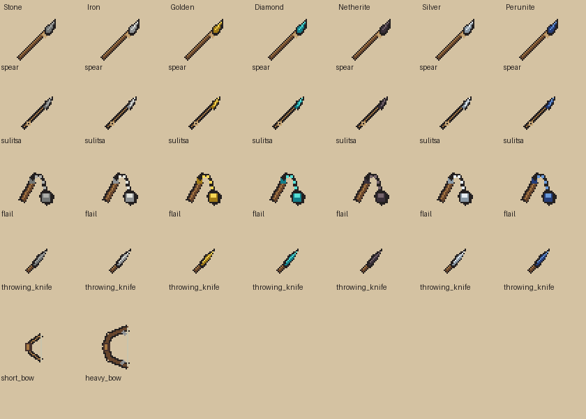

# Оружие 2.0 — 1.3.2.1

## Аудит и решения до создания ресурсов

Цель: Minecraft 1.21.1 / NeoForge 21.1.255 / Java 21. Существуют `spear`, `silver_spear`, `flail`, MaceItem с armor-pressure, ArmorerRecipe и меню 4×4 `armorer_table`, необязательный JeiArmorer, ItemState.RuneState и серверные Runes/RuneEffects. Их ID и уникальные свойства сохраняются. Старые рецепты остаются совместимыми; все новые полноценные предметы собираются через существующий оружейный верстак. Промежуточные детали — обычный верстак. Существующий серебряный tier (220 durability, damage bonus 2) обычный специализированный; перунит (850, bonus 2.5) сохраняет свои реальные характеристики, не превращается в выдуманный сверхнезерит.

Семь материалов: stone, iron, gold, diamond, netherite, silver, perunite. Деревянных вариантов нет; луки имеют ровно две формы без material variants. `spear` остаётся каменным копьём, `silver_spear` — серебряным, `flail` — железным кистенем. У старых экземпляров не меняются ID. Номинальные rune capacities — 1/1/1/2/2/1/3; ранее открытые дополнительные слоты сохраняются как grandfathered state, установленные руны не стираются. Центральные capacity/max/slots/list используют прежний компонент, отдельного rune хранилища нет.

## Заданные силуэты, материалы и пропорции

До генерации новых assets выбраны следующие независимые геометрии. Recolor допустим внутри одной материальной семьи, а не между типами оружия.

| Тип | Силуэт и пропорции | Отличительные детали |
|---|---|---|
| Копьё | Длинная диагональ почти на весь 32×32 холст; древко около 75% длины | Узкий листовидный наконечник, коричневое дерево, короткая обмотка; в руке масштаб больше меча |
| Сулица | Диагональ около 24 px, тоньше и короче копья | Узкий малый наконечник, короткое древко, маленькая петля; метаемая форма |
| Кистень | Короткая рукоять слева, дуга цепи сверху, компактный круглый груз справа снизу | Цепь отделена пустым пространством от рукояти, груз около 7 px, не гигантская булава |
| Метательный нож | Короткий клинок около 10 px плюс 5 px рукоять | Без массивной гарды, широкое пустое поле вокруг, одна вещь на спрайте |
| Короткий лук | Компактная узкая дуга около 19 px, прямая светлая тетива | Светлое дерево, небольшой кожаный хват, тонкие плечи |
| Тяжёлый лук | Высокая широкая дуга около 28 px с усиленными плечами | Тёмное дерево, простые накладки, выраженный хват; без механизмов |

Детали также имеют свои формы: древко — ровная палка, наконечник — отдельный лист/остриё, заготовка — короткая полоска металла, цепь — три звена, груз — компактный шар. Палитры: грубый серый камень, светлый металл, ванильные золотой/cyan/тёмный незерит, обычное серебро и существующий синий перунит. Референсы архива используются как направление, не копируются.

## Приёмка

Итоговые результаты записываются в [машинный отчёт](verification/weapons-1.3.2.1-acceptance.json); ресурсный gate — [отдельно](verification/weapons-1.3.2.1-resources.json). Краткая [ручная проверка](MANUAL_QA_WEAPONS_1.3.2.1.md) включает интерфейс/модели/ввод, двух клиентов, реальный выход в меню и перезаход, выгрузку/загрузку чанка. Клиент автоматически не запускался; headless, native .dat restart и native dimension travel не выдаются за эти ручные проверки. FPS/MSPT не измерялись.

## Реализованные механики и стартовый баланс

`B` ниже — настоящий attack damage bonus установленного Tier. Прочность и enchantability берутся из прежнего Tier, без нового материала/руды. Формулы урона ближнего боя включают обычную базовую единицу игрока и не учитывают чары/эффекты.

| Тип | Ближний урон / скорость | Особенность |
|---|---|---|
| Копьё | `4+B`, 1.2 атаки/сек | Native ENTITY_INTERACTION_RANGE +1.25 только в основной руке; прежний умеренный толчок сохранён |
| Сулица | `3+B`, 1.5/сек | Range +0.5; бросок с 6 тиков, velocity 1.3–2.5, projectile damage `5+B`, cooldown 16 тиков |
| Нож | `2+B`, 2.3/сек | Мгновенный бросок, velocity 1.65, damage `2+0.35B`, cooldown 8 тиков; один durable ItemStack, не стек |
| Кистень | `6+B`, 0.7/сек | Заряженный удар с 18 тиков: `7+B`, ray 4 блока, cooldown 40 тиков; pressure +0.22 при armor 20, общий cap +0.45, затем штатная броня; стандартное отключение щита как у топора |
| Короткий лук | Full draw 12 тиков | Velocity 2.4, arrow base damage ×0.8; штатный натяг замедляет движение до 0.4 вместо 0.2 |
| Тяжёлый лук | Full draw 30 тиков | Velocity 3.6, arrow base damage ×1.15; при полном натяге движение 0.12 вместо 0.2 |

Для сравнения vanilla bow: 20 тиков / velocity 3.0 / обычный base damage. Используются native draw/ammo, Power/Infinity и arrow effects. Эти коэффициенты — кодовый баланс, не измерение FPS или пользовательского DPS. Тяжёлый лук переносит компоненты обычного лука-основы.

Метательное оружие серверно передаёт ровно один ItemStack с потерей одной единицы прочности (с учётом стандартных чар). Удар ножа разрешается один раз, возвращаемая вещь появляется рядом с целью с обратным импульсом. `WeaponProjectile.KNIFE_LOSS_CHANCE=0.25`; блоковое попадание не использует этот шанс. В creative источник не расходуется, подбираемый дубликат не создаётся. Нож летит максимум 24 тика, сулица — 70; затем предмет возвращается в мир. Сулица после попадания использует native arrow collision/pickup. Native NBT хранит stack, owner, damage/resolution/flight state; повторный вызов pickup уже удалённого снаряда не создаёт копию. Если владелец после загрузки недоступен, снаряд не получает возможность обойти его PvP/team rules; таймерное/блоковое восстановление остаётся доступно. Новых глобальных scans / chunk loading в production нет.

## Рецепты, ID и совместимость

Добавлено 53 новых Item ID: 27 полноценного оружия и 26 компонентов. Вместе с прежними `spear`, `silver_spear`, `flail` — 30 форм оружия. Полный список — в ресурсном отчёте. Шаблоны ID:

- `{material}_sulitsa`, `{material}_throwing_knife`: все семь материалов;
- `{material}_spear`, кроме каменного `spear` (старый ID); серебряное сохраняет `silver_spear`;
- `{material}_flail`, кроме железного `flail` (старый ID);
- `{material}_spearhead`, `{material}_light_spearhead`, `{material}_flail_ball`;
- `iron_blank`, `spear_shaft`, `short_shaft`, `flail_handle`, `flail_chain`, `short_bow`, `heavy_bow`.

Новый Entity ID — `weapon_projectile`, общий для двух настоящих метательных семейств с разными отображаемыми предметами. Новый serializer — `rune_safe_repair`; recipe ID `minecraft:repair_item` сохранён. Mod ID, старые item/block/menu/recipe ID и vanilla advancements не переименованы.

36 новых bench recipes и 23 рецепта деталей. Железная заготовка — 3 nuggets горизонтально; цепь — 3 vanilla chains вертикально; груз — 5 материалов крестом. Копьё/сулица — соответствующие древко и наконечник; кистень — рукоять, специальная цепь и груз. Железный нож обязательно использует заготовку. Улучшение алмазного оружия/детали требует один netherite ingot, сохраняет компоненты; нетеритовые детали также реально используются при сборке. Луки не получают материальных вариантов. Старые рецепты сохранены побайтно для совместимости, в том числе исторические crafting-рецепты уже существующих копий.

Bench recipes доступны через существующий JEI plugin и через кнопку `?` существующего ArmorerScreen без JEI. Просмотр использует синхронизированный RecipeManager, не отдельную копию правил; серверное создание/расход остаётся в ArmorerMenu. Optional JEI не загружается common/server кодом.

## Руны, починка и старое оружие

78 реальных оружейных записей vanilla/Slavic Myths проверены в loader-backed audit: [каталог](verification/weapons-1.3.2.1-catalog.json). Включены мечи, топоры, луки, арбалеты, трезубец, vanilla mace, прежние и новые модовые предметы. Кинжал Соловья теперь определяется как dagger, подводные/погребальные копья — spear. Обычные bow/crossbow/trident/mace/shield остаются с двумя слотами; перунит и прежние специальные изделия — три. Посох Велеса добавлен как специальный artifact/staff с тремя слотами, без превращения его в новую материальную семью или изменения вызова хранителя. Серебро — один слот; прежние открытые слоты сохраняются.

Tooltip показывает занятые/максимальные, открытые и свободные слоты, список рун. До открытия слотов рун нет: градация задаёт потолок, не выдаёт бесплатные руны. Существующие цены/предметы перековки сохраняются, включая заработанную RuneKnowledge скидку. RpgEvents берёт эффекты из реального firing/carry stack, а не из сменённого предмета в руке.

Наковальня копирует руническую основу слева; при несовместимом рунном состоянии справа операция не расходует предметы. На точиле аналогично сохраняется верхняя основа и запрещается расход несовместимых рунических предметов. Repair recipe на обычном верстаке переносит RuneState и данные основы; стандартные vanilla правила снятия чар/сохранения curses остаются действующими. Материальная починка на наковальне сохраняет чары и руны. Улучшение через bench переносит components patch основы и использует новые defaults материала; новая rune storage не создаётся.

## Аудит старого визуала

Существующие модели/текстуры не упрощались. Реальные старые модели: `thunder_spear` — 30 cuboids, `perunite_sword` — 30, `thunder_axe` — 24, `flail` — 23, `spear` — 21, `silver_spear` — 20, `silver_dagger` — 17, `veles_staff` — 15, `nightingale_dagger` — 12, `storm_staff` — 11. Часть использует atlas/vanilla block textures, поэтому плоский texture sheet не является видом предмета в игре.

Кандидаты на отдельную ручную оценку плотности декора: thunder_spear, perunite_sword и thunder_axe. Это предложение точечно проверить самые сложные модели рядом с vanilla, не вывод об обязательном упрощении и не автоматически выполненная замена. Сохранность прежних resources подтверждается побайтной сверкой с установленным production JAR 1.3.1.

## Изменённые модули и воспроизводимость

Common: WeaponCatalog, ThrowingWeaponItem, WeaponProjectile, FieldBowItem; расширены SpearItem/FlailItem, Runes/RpgEvents, RuneRepair, ArmorerRecipe и startup/registry. Client: WeaponProjectileRenderer, FieldBowClient, ArmorerRecipeScreen и маленькая кнопка ArmorerScreen; tooltip дополнен в RpgClient. Recipe codec/stream хранит необязательный `copy_components` с default false для исторических рецептов; network compatibility version поднята до 1.3.2.1, чтобы старый клиент не читал другой recipe stream.

`tools/weapon_resources_1321.py` воспроизводит новые assets/рецепты/локализацию без отката старых механик. `tools/verify_weapons_1321.py` сверяет реальные ресурсы и production JAR. Fixtures — `tools/weapon-tests`, только opt-in `-PweaponRuntimeCheck`, мир `run-weapons-1321`; в production JAR не входят. Restart: отдельные процессы `-PweaponRestartPhase=write` и `verify`. Руны 2.0, новые руды, новая магия/классы/структуры и отдельный оружейный блок не добавлялись.

## Финальная проверка

Реализованы 30 форм оружия: копья, сулицы, кистени и метательные ножи семи материалов, короткий и тяжёлый луки. 53 новых предмета включают детали; три прежних оружейных ID сохранены. 36 рецептов оружейного верстака и 23 рецепта деталей; просмотр рецептов работает без JEI. Разные силуэты, ru_ru/en_us, серверные броски/подбор, сохранение данных и совместимые ремонты. Централизованы ёмкость рун и категории существующего оружия; ранее открытые слоты сохранены.

Финальный `gradlew.bat clean build` PASS; 15 067 проверок ресурсов/JAR PASS, 2 566 прежних ресурсов сохранены побайтно. Итоговые headless suites: оружие 16/16, классы 15/15. 11 реальных серверных запусков, ноль клиентов. 30 оружейных стеков проверены после загрузки player .dat новым процессом; проверены смерть и два нативных перехода между измерениями. 512 столкновений ножа: 117 потерь при заданной вероятности 25%.

[Реализация, характеристики и рецепты](WEAPONS_1.3.2.1.md), [отчёт и ограничения](verification/weapons-1.3.2.1-acceptance.json), [ручная приёмка](MANUAL_QA_WEAPONS_1.3.2.1.md). Клиентский вид, GUI, бой нескольких игроков и реальный выход/перезаход остаются ручными; FPS/MSPT не измерялись. После серверных gates по запросу пользователя PolyMC обновлён до 1.3.2.1 с резервной копией 1.3.1. [Квитанция](verification/polymc-1.3.2.1-installation.json). Клиент не запускался; commit и push не выполнялись.

